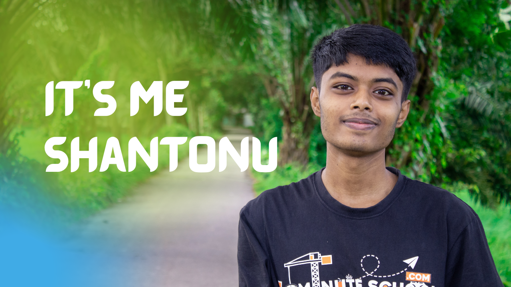
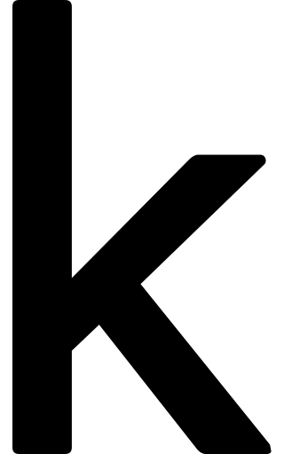

<h1 align = "center">Hey! I am Shantonu Acharjee</h1>
  

# About Me

I am a student of the Electronics Department, PCB Designer, and Python developer. I started my freelancing career back in 2018 locally. Till now I have developed 35+ electronics, robotics, and python projects using my skills in product prototyping, PCB design, and development. Recently I made Robot Meena, Fire Fighter Robo(Max), Face Mask Detection With Arduino Door Lock, Artificial GirlFriend (Borsha), and Smart House for the science fair. And We have achieved first place for two years in a row.

 

- 🔭 I’m currently working on [Robot Meena](https://github.com/Shantonu-Acharjee/Robot-Meena)

- 🌱 I’m currently learning **Artificial intelligence**

- 👨‍💻 All of my projects are available at [https://github.com/Shantonu-Acharjee?tab=repositories](https://github.com/Shantonu-Acharjee?tab=repositories)

- 📝 I regularly write articles on [https://shantonuacharjee.blogspot.com](https://shantonuacharjee.blogspot.com)

- 📫 Reach me **ShantonuAcharjee@gmail.com**

- 📄 Know about my experiences [https://www.linkedin.com/in/shantonu-acharjee](https://www.linkedin.com/in/shantonu-acharjee)    

# Connect with me:
- Phone   :- +880 1789333514
- Email   :- ShantonuAcharjee@gmail.com
- Website :- https://shantonuacharjee.blogspot.com

 

    

  Copyright © 2019 [Shantonu Acharjee](https://shantonuacharjee.blogspot.com).

